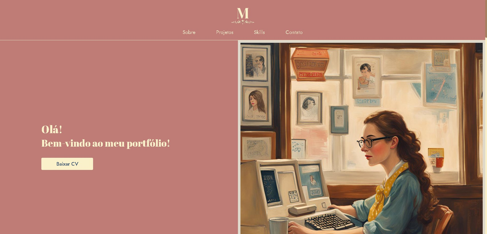

<h1 align="center">
  Portfólio - Midian Tossani
</h1>

<h3 align="center"><a href="https://midiantossani.netlify.app/">Clique para visitar o projeto</a></h3>
 

## 📚 Seções

O site é composto por cinco seções:

- **Home:** Nele temos uma breve apresentação;
- **Quem sou:** Nessa seção tenho uma descrição dizendo um pouco sobre mim;
- **Projetos:** Apresenta alguns projetos desenvolvidos e com link direto para os códigos no GitHub;
- **Conhecimentos:** Nele apresentamos meus conhecimentos em algumas tecnologias como o foco no front-end e UX/UI Design;
- **Contato:** Nesta seção, você pode entrar em contato e preencher um formulário para enviar uma mensagem direta;

---

## 💼 Tecnologias utilizadas

Para o desenvolvimento deste site utilizei as seguintes tecnologias:

- HTML;
- CSS;
- JavaScript;
- ScrollReveal;
- Figma (prototipagem)

---

<h2>Autor</h2>

 Designed and Coded with S2 by <a href="https://github.com/midiantossani">Midian Tossani.</a>

